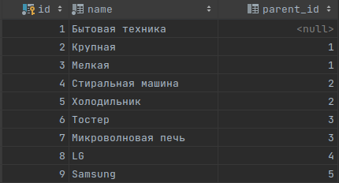

# Category-bot 

---
## Описание
Этот бот для Telegram предоставляет возможности управления древовидной структурой категорий, используя команды для создания, отображения и удаления элементов. Также поддерживается загрузка и выгрузка данных в формате Excel.

## Основные функциональные возможности

- **Команда: /viewTree**
    - Отображает дерево категорий в структурированном виде.

- **Команда: /addElement <название элемента>**
    - Добавляет новый элемент как корневой, если у него нет родительского элемента.

- **Команда: /addElement <родительский элемент> <дочерний элемент>**
    - Добавляет дочерний элемент к существующему элементу. Если родительский элемент не существует, бот отправляет соответствующее сообщение.

- **Команда: /removeElement <название элемента>**
    - Удаляет указанный элемент вместе с его дочерними элементами. Если элемент не найден, бот отправляет соответствующее сообщение.

- **Команда: /help**
    - Отображает список доступных команд и их краткое описание.

## Дополнительные команды

- **Команда: /download**
    - Скачивает Excel-документ с деревом категорий.

- **Команда: /upload**
    - Принимает Excel-документ с деревом категорий и сохраняет все элементы в базе данных.

## Пример данных



## Запуск проекта через Docker Compose

Для запуска бота через Docker Compose используйте следующий шаги:

1. Убедитесь, что в файле `.env` заданы все необходимые переменные среды для корректного функционирования бота и базы данных.
2. Убедитесь, что в `docker-compose.yml` указаны все необходимые сервисы, такие как база данных и сам бот.
3. Выполните команду для запуска контейнеров:
    ```bash
    docker-compose up --build
    ```
4. Приложение будет запущено на порту `18080`  

## Технологии
- Java
- Spring Boot
- PostgreSQL
- TelegramBots API
- FastExcel для работы с Excel
- Liquibase для миграции БД

## Установка и запуск

1. Клонируйте репозиторий:
    ```bash
    git clone https://github.com/webbnba/category-bot.git
    ```

2. Запустите проект с помощью Docker Compose:
    ```bash
    docker-compose up --build
    ```

## Переменные окружения

- `BotToken` - Токен вашего Telegram бота.

